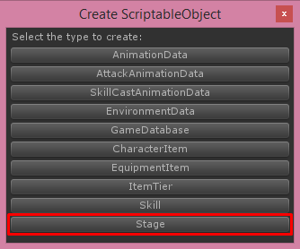

* * *

This is the guide for Turnbase RPG game template which selling at Unity Asset Store ([https://www.assetstore.unity3d.com/#!/content/107578?aid=1100lGeN](https://www.assetstore.unity3d.com/#!/content/107578?aid=1100lGeN))

You can create stage by right click on **Project** tab then choose **Create -> ScriptableObject**

Then choose **Stage**

Then new stage will be created, you must set its name to be unique (Not be the same as another stages)

Each stage there are following configs

*   **Title**, stage’s title/name
*   **Description**, stage’s description
*   **Stage Number**, the display number which you show on UI
*   **Icon**, stage’s icon
*   **Environment**, environment that will be appears when playing the stage
*   **Waves**, its length will be amount of waves when playing the stage each wave you can set: **Use Random Foes**, if this is **True** this will use foes data from **Random Foes**. **Foes**, Foe character with its level.
*   **Random Foes**, Randoming foes for every waves when the wave is use random foes
*   **Require Stamina**, require stamina to start playing the stage
*   **Random Soft Currency Min Amount** and **Random Soft Currency Max Amount**, reward soft currency will random by min value to max
*   **Reward Player Exp**, Amount of exp that player will receive when clear the stage
*   **Reward Character Exp**, Amount of exp that character will receive when clear the stage
*   **Reward Items**, item that player can receive when clear the stage
*   **Unlock Stages**, stages that will be unlocked after clear the stage

After prepare the stage you have to set it to stage selection UI to make it available to select at **ManageScene** which located at **/Assets/RPGGame/Demo/Scenes**

For the example **ManageScene** you can see how to add stage UI in **ManageSceneManager/UIStages/Stages**

