* * *

This is the guide for Turnbase RPG game template which selling at Unity Asset Store ([https://www.assetstore.unity3d.com/#!/content/107578?aid=1100lGeN](https://www.assetstore.unity3d.com/#!/content/107578?aid=1100lGeN))

Now we’ve Gamesparks integration, if you want to use Turnbase RPG game template with Gamesparks to keep players data to server, you have to register your Gamesparks account then create your game project in Gamesparks.

To use Gamesparks with your project, for client side, you have to download Gamesparks SDK from [https://docs.gamesparks.com/sdk-center/unity.html](https://docs.gamesparks.com/sdk-center/unity.html) (Download link is on top of the page), After import the package set GameSparks API Key and GameSparks API Secret in Gamesparks settings

Select to menu: GameSparks -> Edit Settings

Set Api Key/Secret that can copy from your Dashboard

Then download and import package to your project from [https://github.com/insthync/gamesparks-tbrpg-addons/releases](https://github.com/insthync/gamesparks-tbrpg-addons/releases)

Then in LoginScene remove “Lite Db Game Service” component from “GameInstance” then add “GS Game Service” and “Game Sparks Unity”

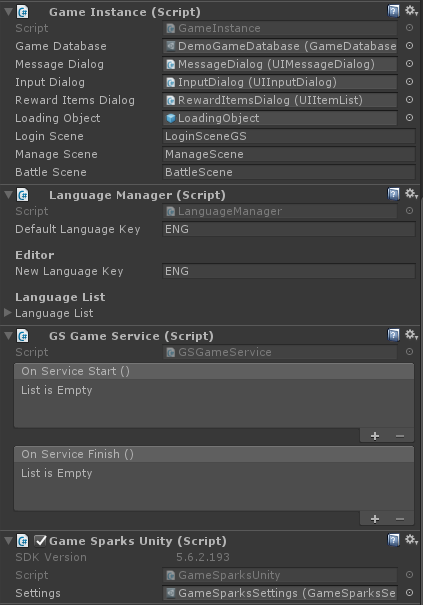

For server side, you have to create currencies to matches with client’s GameDatabase for example, the database have GOLD as soft currency and GEM as hard currency

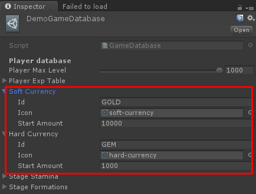

Then you have to create GOLD and GEM currency in Gamesparks

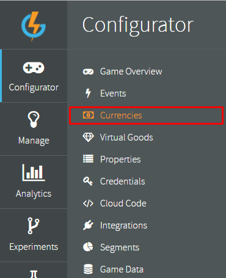

Then create event named “SERVICE\_EVENT” with “TARGET” as String type and “DATA” as JSON type

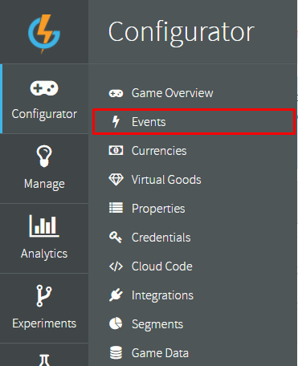

Then download release cloud code from [https://github.com/insthync/CloudCode-GS-TBRPG](https://github.com/insthync/CloudCode-GS-TBRPG) then import it in cloud code section

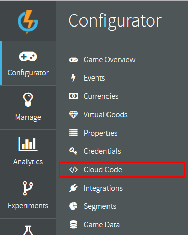

Then when you have changes game content at your client you have to export data via “GS Game Service”’s context menu named “Export Game Database”

Save it anywhere then open it with Notepad (or another text editor) then copy its content and paste it to Cloud code -> Modules -> GAME\_DATA

Then replace “game database” content

Then go back to your client and try to play the game.

If you have any problems feels free to ask me in “Responses” section

* * *

For who use Gamesparks after 2017 you will force to use new Data Service API, we already update the Cloud codes to support it.

But there are some tasks you have to do

Go to **Configurator -> Game Data**

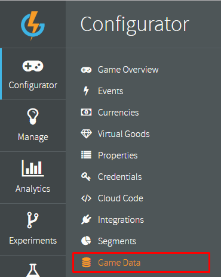

Then add following data with indexes

*   player — with following indexes: id (string)

*   playerBattle — with following indexes: dataId (String), id (String), playerId (String), session (String), timestamp (Number)

*   playerClearStage — with following indexes: dataId (String), id (String), playerId (String), timestamp (Number)

*   playerFormation — with following indexes: dataId (String), id (String), playerId (String), position (String), timestamp (Number)

*   playerItem — with following indexes: amount (Number), dataId (String), id (String), playerId (String), timestamp (Number)

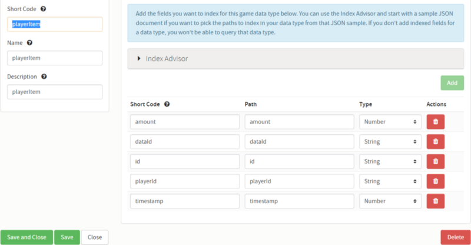

*   playerStamina — with following indexes: dataId (String), id (String), playerId (String), timestamp (Number)

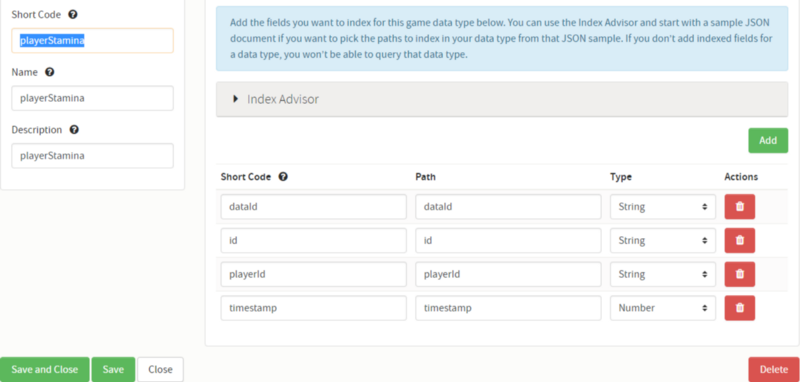

*   playerUnlockItem — with following indexes: dataId (String), id (String), playerId (String), timestamp (Number)

*   playerFriend — with following indexes: id (string), playerId (string), targetPlayerId (string), timestamp (Number)

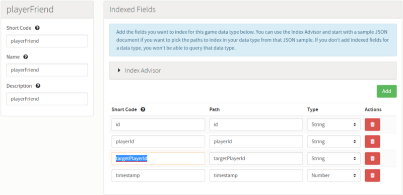

*   playerFriendRequest — with following indexes: id (string), playerId (string), targetPlayerId (string), timestamp (Number)

So you will have data like this

* * *

#### In-App Purchase Integration

From version 1.06 and above, it is already integrated In-App Purchase, but you will have to add integration data for GameSpark.

In your game dashboard, go to **Integrations** menu

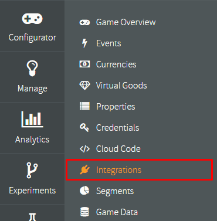

Then set **Google App ID** and **Google Play Public Key**

*   **Google App ID** it is package name which you set in **Build Settings**, eg. com.suriyun.tbrpg
*   **Google Play Public Key**, you can find it in Google Play Console → App Dashboard

Then set Apple Bundle ID

*   **Apple Bundle ID** it is package name which you set in **Build Settings**, eg. com.suriyun.tbrpg

Then add Virtual Goods, each virtual good you have to set following data:

*   **Short Code**, use **Product ID** which you set in **IapPackage** data

Use this value as short code

*   **Name**
*   **Description**
*   **iOS Product ID**, the product ID which you have set in Apple app store
*   **Google Product ID**, the product ID which you have set in Google Play console

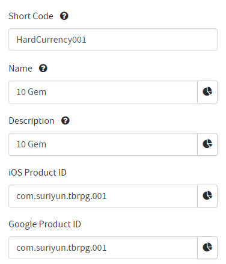

Here is example data that I’ve set for the Demo

